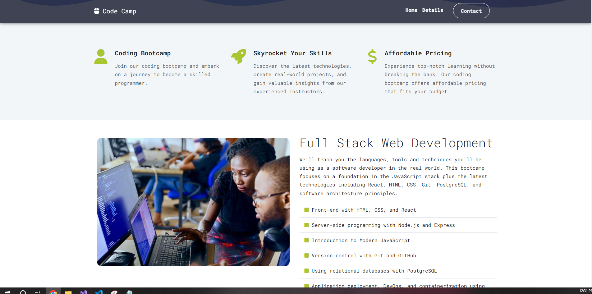

# Code Camp Website

Welcome to the Code Camp Application repository! This repository contains the code for a simple Coding Bootcamp website that provides information about our Full Stack Developer course. Here's a brief overview of what you'll find in this repository:

## Features

- **Full Stack Developer Course Details:** Learn about our comprehensive Full Stack Developer course, which covers both front-end and back-end development technologies. Whether you're a beginner or looking to enhance your skills, this course is designed to cater to various skill levels.

- **Students Testimonials:** Read testimonials from students who have successfully completed our Full Stack Developer course. Hear about their experiences and how the course has helped them achieve their coding goals.

- **Contact Form:** Reach out to us using the contact form provided on the website. Whether you have questions about the course or want to know more about our offerings, our team is here to assist you.

## Technologies Used

- HTML5 for structuring the content.
- Bootstrap Sass for responsive and customizable styling.
- JavaScript for interactive elements and functionality.

# Project Screenshot

